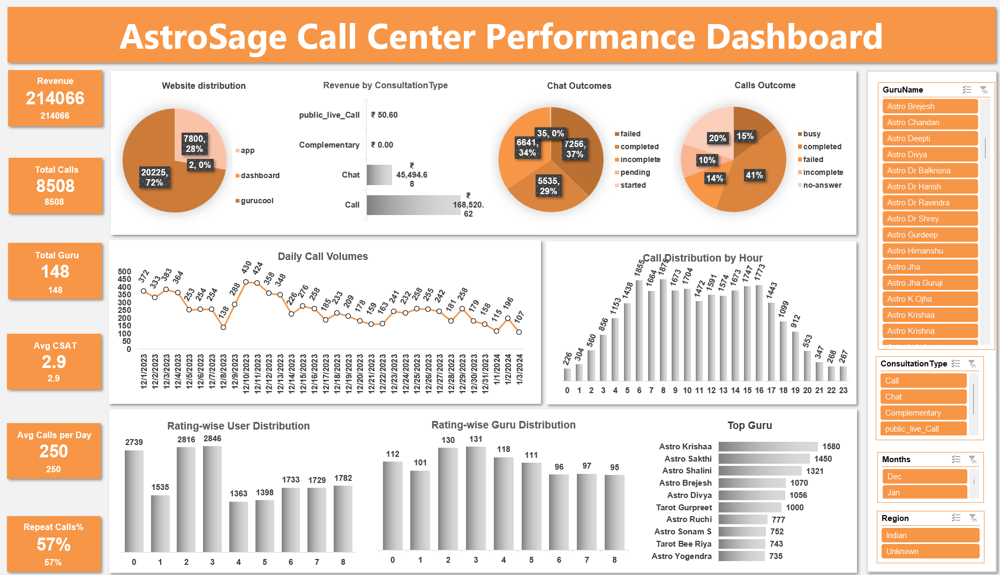

# AstroSage Call Center Performance Analysis
📊 Data-Driven Insights to Optimize Operations  

## 👤 Author
**Sunny Bibyan** | Data Analyst  

## 📌 Project Overview
AstroSage received a ₹1 crore investment to improve its **call center efficiency, customer satisfaction, and profitability**.  
This project analyzes **28,027 consultation records** (Dec 2023 – Jan 2024) using Excel dashboards, pivot tables, and statistical functions.  

## 🎯 Objectives
- Analyze **call volumes & satisfaction trends**
- Identify **efficiency gaps & workload imbalance**
- Recommend **strategic investments** (tech, training, incentives, hiring)

## 🗂 Dataset
- **Source:** AstroSage Call Center Logs  
- **Size:** 28,027 records  
- **Attributes:** 35 (user, guru, call/chat status, duration, rating, financials, etc.)  

## 🛠 Methodology
- Data Cleaning → standardization, missing value imputation  
- Exploratory Analysis → PivotTables, trends, correlations  
- Visualization → Bar charts, pie charts, heatmaps  
- KPI Identification → Call volume, cost, agent utilization, CSAT  
- Dashboard Creation → Interactive slicers for Month, Guru, Consultation Type  

## 📊 Key Insights
- **57.35% repeat calls** → poor First Call Resolution  
- **41% call completion rate** → efficiency gap  
- **Avg. CSAT < 3/8** → urgent need for service improvement  
- **High workload imbalance** → some gurus overloaded, many underutilized  

## 💡 Strategic Recommendations
1. **Technology Upgrade (40%)** → CRM + AI Routing + Speech Analytics  
2. **Training Programs (35%)** → Guru Excellence Program  
3. **Performance Incentives (15%)** → linked to CSAT & FCR  
4. **Phased Hiring (10%)** → only after efficiency gains  

## 📈 Dashboard Preview

## 📂 Repository Contents
- AstroSage Analysis-SpreadSheet Project_3.zip 
- `/images` → Dashboard screenshots
- README.md
  

## 🚀 Tools Used
- **Excel (PivotTables, charts, conditional formatting)**  
- **Functions:** COUNT, AVERAGE, CORREL, STDEV  
- **Visualization:** Bar/Line/Scatter/Heatmap  

## 🔗 Resume Highlight
> "Developed a full-scale data analysis project for **AstroSage Call Center**, presenting insights via Excel dashboards, statistical functions, and a professional PPT. Recommended a ₹1 crore strategic investment plan to improve efficiency, satisfaction, and profitability."
